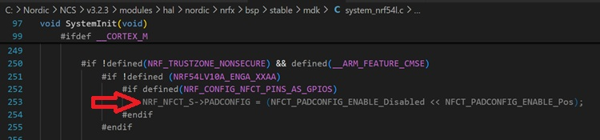

# NFC: Using NFC pins as regular GPIO pins

On the nRF54L15, pins P1.02 (NFC1) and P1.03 (NFC2) are configured as NFC antenna pins by default. To use them as regular GPIOs, you need to do the following:

## Add the Device Tree overlay configuration
In your board overlay file (.overlay), add:

    &uicr {
           nfct-pins-as-gpios;
    };

 This is the recommended approach for nRF54L15 with the nRF Connect SDK.

### How it works:
Setting <code>nfct-pins-as-gpios</code> in the <code>uicr</code> node causes the CMake build system to define <code>NRF_CONFIG_NFCT_PINS_AS_GPIOS</code>, which in turn causes <code>SystemInit()</code> to disable the NFC pad configuration by writing to the <code>PADCONFIG</code> register:

  

## Alternative: Manual approach in code
If the overlay approach doesn't work in your setup (e.g. bare-metal SDK), you can disable the NFC pads manually early in your application:

    static int disable_nfc_pins_early(const struct device *dev)
    {
        ARG_UNUSED(dev);
        NRF_NFCT->PADCONFIG = 0;
        return 0;
    }

    SYS_INIT(disable_nfc_pins_early, PRE_KERNEL_1, 0);

## __Important Notes__ 
 - When <code>PADCONFIG.ENABLE</code> is set to Disabled, the NFC protection circuit is also disabled, so the chip will __not__ be protected against strong NFC fields if an NFC antenna is connected.
 - The NFC pins have __higher pin capacitance__ and some __leakage current__ between them when used as GPIOs and driven to different logical values. To save power, set both pins to the same logical value before entering power-saving modes.
 - If using the nRF54L15 DK hardware, you also need to move the 0 Ω resistors from R21/R22 to R33/R34.
